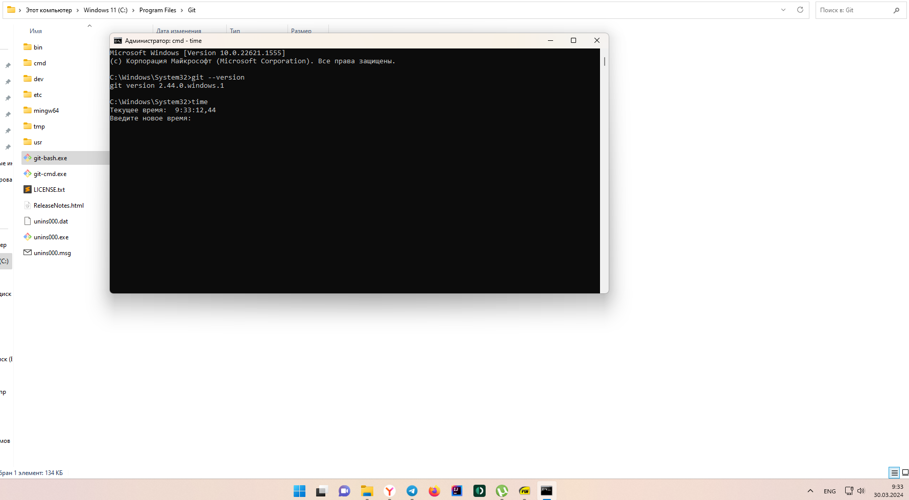
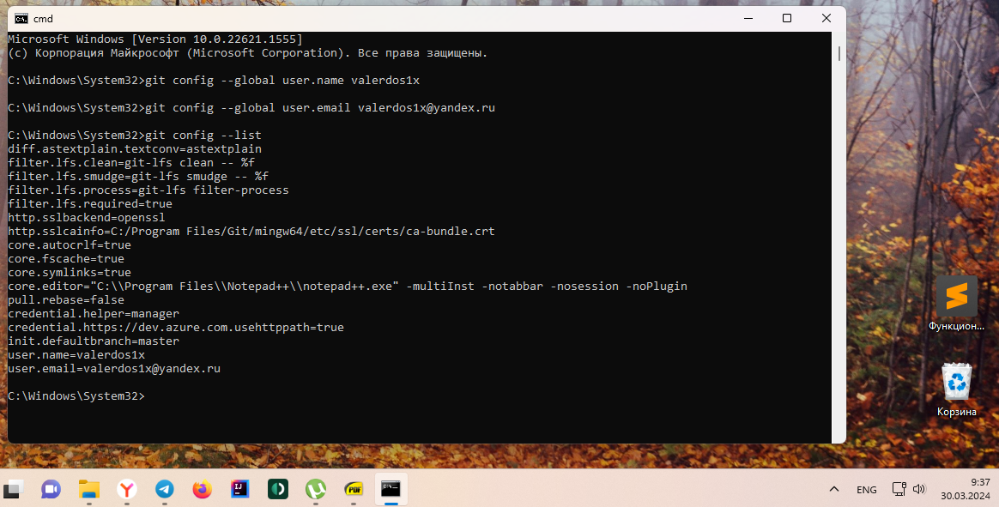
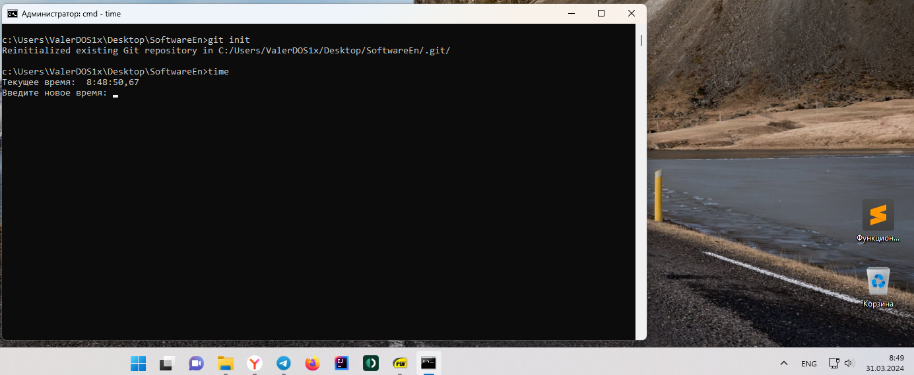
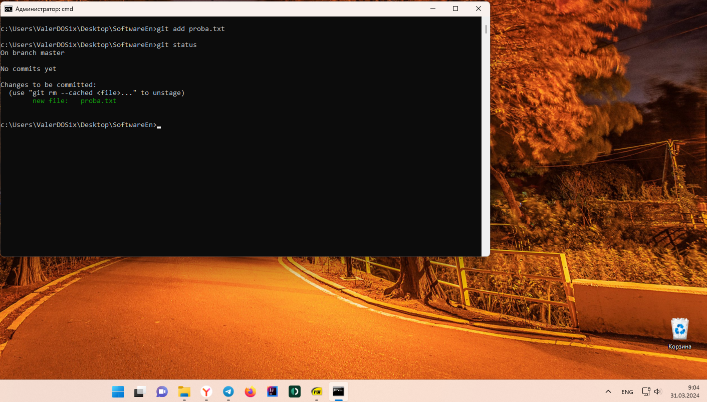
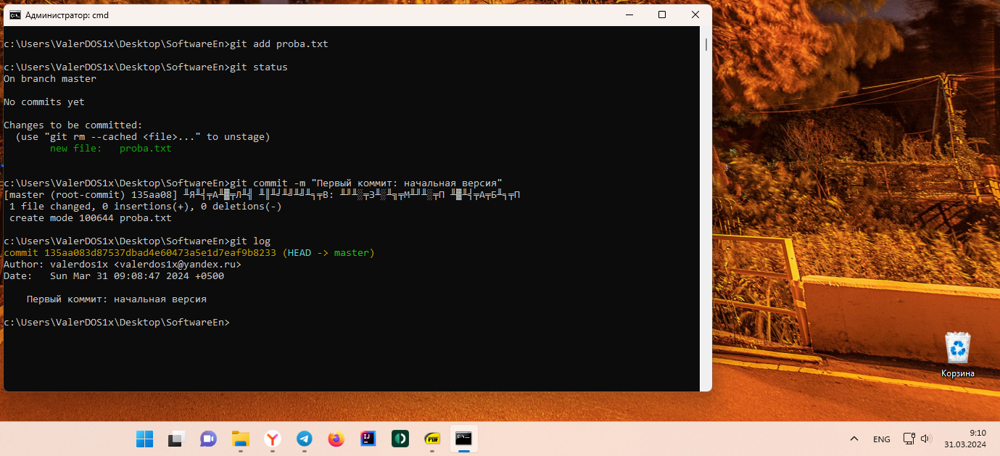
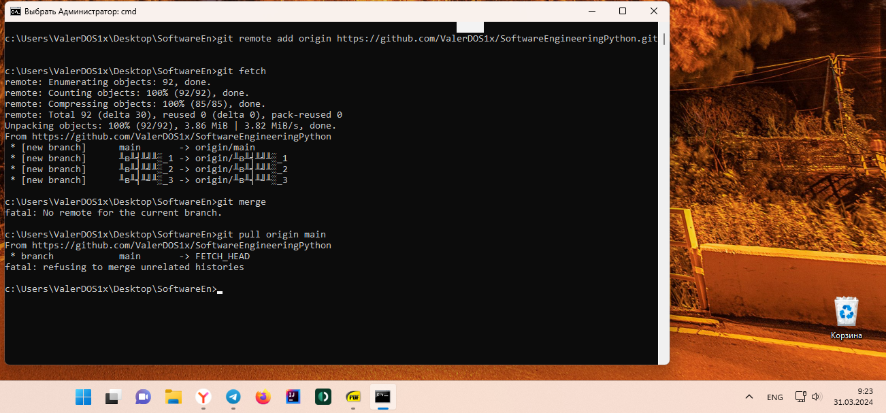
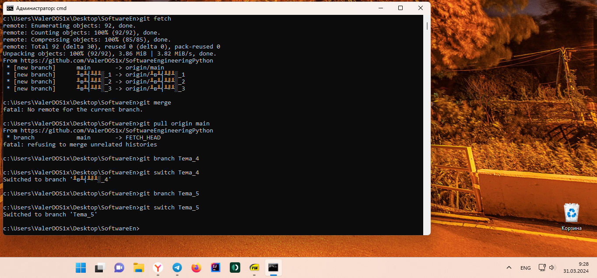
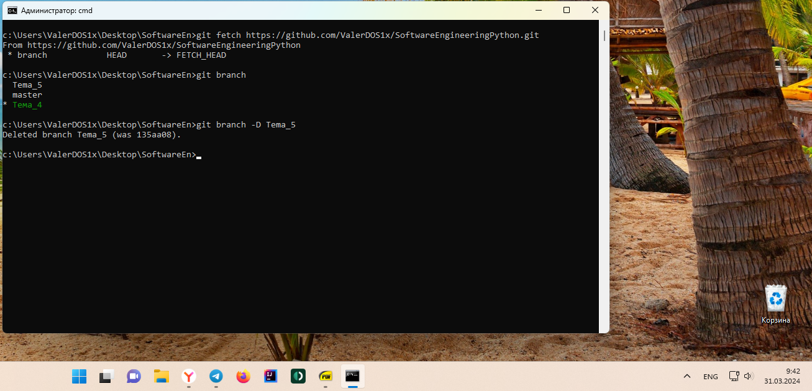
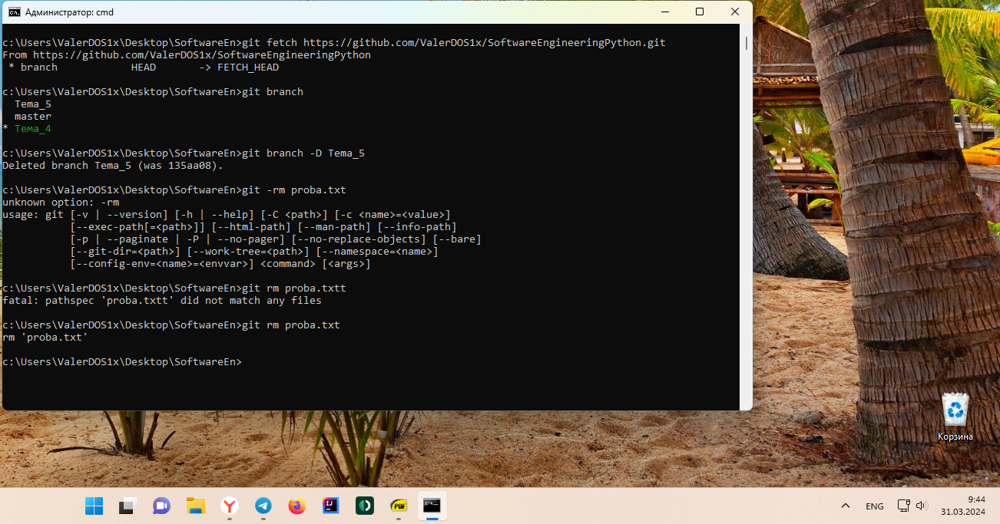

Отчет по Теме #1 выполнил:
- Стаценко Валерий Олегович
- ИНО ЗБ ПОАС-22-2

| Задание | Сам_раб |
| ------ | ------ |
| Задание 1 | + |
| Задание 2 | + |
| Задание 3 | + |
| Задание 4 | + |
| Задание 5 | + |
| Задание 6 | + |
| Задание 7 | + |
| Задание 8 | + |
| Задание 9 | + |
| Задание 10 | + |
| Задание 11 | + |
| Задание 12 | + |
| Задание 13 | + |
| Задание 14 | + |
| Задание 15 | + |

знак "+" - задание выполнено; знак "-" - задание не выполнено;

Работу проверили:
- к.э.н., доцент Панов М.А.
 
## 1. Установка

## 2.2. Настройка

## 2.3. Создание нового репозитория

## 2.4. Подготовка файлов

## 2.5. Фиксация изменений

## 2.6. Подключение к удаленному репозиторию

## 2.7. Ветвление

## 2.8. Особенности применения «Фетч»

## 2.9. Удаление файлов, веток, локальных и удалённых репозиториев

## 2.10. Отслеживание изменений в коммитах

## 2.11. Возвращение файла к предыдущему (определенному) состоянию

## 2.12. Возвращение к предыдущему коммиту

## 2.13. Исправление коммита

## 2.14. Разрешение конфликтов при слиянии

## 2.15. Настройка .gitignore

