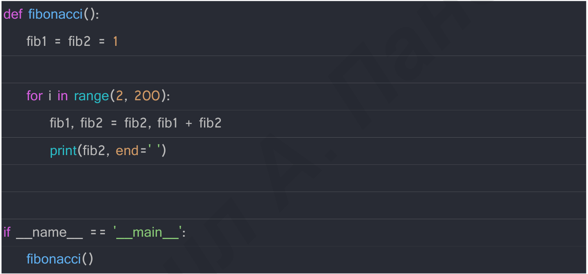

Отчет по Теме #10 выполнил:
- Стаценко Валерий Олегович
- ИНО ЗБ ПОАС-22-2

| Задание | Сам_раб |
| ------ | ------ |
| Задание 1 | + |
| Задание 2 | + |
| Задание 3 | + |
| Задание 4 | + |
| Задание 5 | + |

знак "+" - задание выполнено; знак "-" - задание не выполнено;

Работу проверили:
- к.э.н., доцент Панов М.А.

## Самостоятельная работа №1
Вовочка решил заняться спортивным программированием на python, но
для этого он должен знать за какое время выполняется его программа.
Он решил, что для этого ему идеально подойдет декоратор для
функции, который будет выяснять за какое время выполняется та или
иная функция. Помогите Вовочке в его начинаниях и напишите такой
декоратор.
Подсказка: необходимо использовать модуль time
Декоратор необходимо использовать для этой функции:

Результатом вашей работы будет листинг кода и скриншот консоли, в
котором будет выполненная функция Фибоначчи и время выполнения
программы.
Также на этом примере можете посмотреть, что решение задач через
рекурсию не всегда является хорошей идеей. Поскольку решение
Фибоначчи для 100 с использованием рекурсии и без динамического
программирования решается более десяти секунд, а решение точно
такой же задачи, но через цикл for еще и для 200, занимает меньше 1
секунды.

```python
import time


def timer_decorator(func):
    def wrapper(*args, **kwargs):
        start_time = time.time()
        result = func(*args, **kwargs)
        end_time = time.time()
        print(f'\nФункция была выполнена за {end_time - start_time} сек.')
        return result

    return wrapper


@timer_decorator
def fibonacci():
    fib1 = fib2 = 1
    for i in range(2, 400):
        fib1, fib2 = fib2, fib1 + fib2
        print(fib2, end=' ')


if __name__ == '__main__':
    fibonacci()
```

### Результат


  
## Самостоятельная работа №2
Посмотрев на Вовочку, вы также загорелись идеей спортивного
программирования, начав тренировки вы узнали, что для решения
некоторых задач необходимо считывать данные из файлов. Но через
некоторое время вы столкнулись с проблемой что файлы бывают
пустыми, и вы не получаете вводные данные для решения задачи.
После этого вы решили не просто считывать данные из файла, а всю
конструкцию оборачивать в исключения, чтобы избежать такой
проблемы. Создайте пустой файл и файл, в котором есть какая-то
информация. Напишите код программы. Если файл пустой, то, нужно
вызвать исключение (“бросить исключение”) и вывести в консоль
“файл пустой”, а если он не пустой, то вывести информацию из файла.

```python
def read_file(filename):
    try:
        file = open(filename, 'r', encoding='utf-8-sig')
        content = file.read()
        if not content:
            raise Exception(f"{filename} пустой")
        print(content)
    except Exception as e:
        print(str(e))


if __name__ == '__main__':
    read_file('empty.txt')
    read_file('noempty.txt')
```

### Результат


  
## Самостоятельная работа №3
Напишите функцию, которая будет складывать 2 и введенное
пользователем число, но если пользователь введет строку или другой
неподходящий тип данных, то в консоль выведется ошибка
“Неподходящий тип данных. Ожидалось число.”. Реализовать
функционал программы необходимо через try/except и подобрать
правильный тип исключения. Создавать собственное исключение
нельзя. Проведите несколько тестов, в которых исключение вызывается
и нет. Результатом выполнения задачи будет листинг кода и
получившийся вывод в консоль.

```python
def sum_num():
    try:
        num = float(input('Введите число:\n'))
        res = num + 2
        return res
    except ValueError:
        return 'Неподходящий тип данных. Ожидалось число.'

print(sum_num())
print(sum_num())
```

  ### Результат


  
## Самостоятельная работа №4
Создайте собственный декоратор, который будет использоваться для
двух любых вами придуманных функций. Декораторы, которые
использовались ранее в работе нельзя воссоздавать. Результатом
выполнения задачи будет: класс декоратора, две как-то связанными с
ним функциями, скриншот консоли с выполненной программой и
подробные комментарии, которые будут описывать работу вашего
кода.
  
```python
# Определение класса-декоратора my_decorator
class my_decorator:
    # Инициализация метода конструктора с функцией func
    def __init__(self, func):
        self.func = func

    # Определение метода call, который будет вызываться при применении декоратора к функции
    def __call__(self, *args, **kwargs):
        print(f'Декоратор до выполнения функции "{self.func.__name__}"')  # Вывод сообщения перед выполнением функции
        result = self.func(*args, **kwargs)  # Выполнение функции с переданными аргументами
        print(f'Декоратор после выполнения функции "{self.func.__name__}"')  # Вывод сообщения после выполнения функции
        return result


# Декорирование функций addition и multiply с помощью декоратора my_decorator
@my_decorator
def addition(a, b):
    return a + b  # сложение входящих аргуметов


@my_decorator
def multiply(a, b):
    return a * b  # умножение входящих аргуметов


# Запрос у пользователя двух чисел для выполнения операций
x = int(input('Введите первое число: '))
y = int(input('Введите второе число: '))

# Вызов функций addition и multiply с введенными числами в качестве аргументов
print(addition(x, y))
print(multiply(x, y))
```

### Результат


  
## Самостоятельная работа №5
Создайте собственное исключение, которое будет использоваться в
двух любых фрагментах кода. Исключения, которые использовались
ранее в работе нельзя воссоздавать. Результатом выполнения задачи
будет: класс исключения, код к котором в двух местах используется это
исключение, скриншот консоли с выполненной программой и
подробные комментарии, которые будут описывать работу вашего
кода.
  
```python
class MyException(Exception):
    pass


# Функция, которая вызывает исключение, если число не положительно
def positive_number(n):
    try:
        if n <= 0:  # Проверка, является ли число положительным
            raise MyException(f'{n} не является положительным числом')
        print(f'Введено положительное число: {n}')  # Вывод положительного числа
    except MyException as e:
        print(f'Поймано исключение: {e}')  # Вывод информации об исключении


# Функция, которая вызывает исключение, если строка не содержит только цифры
def only_letters(s):
    try:
        if not s.isalpha():  # Проверка, содержит ли строка только буквы
            raise MyException(f'{s} содержит не только буквы')
        print(f'Введена строка только из букв: {s}')  # Вывод строки, состоящей только из букв
    except MyException as e:
        print(f'Поймано исключение: {e}')  # Вывод информации об исключении


# Тестирование функций
test_num = int(input('Введите число: '))
positive_number(test_num)
test_string = input('Введите строку: ')
only_letters(test_string)
```

### Результат


