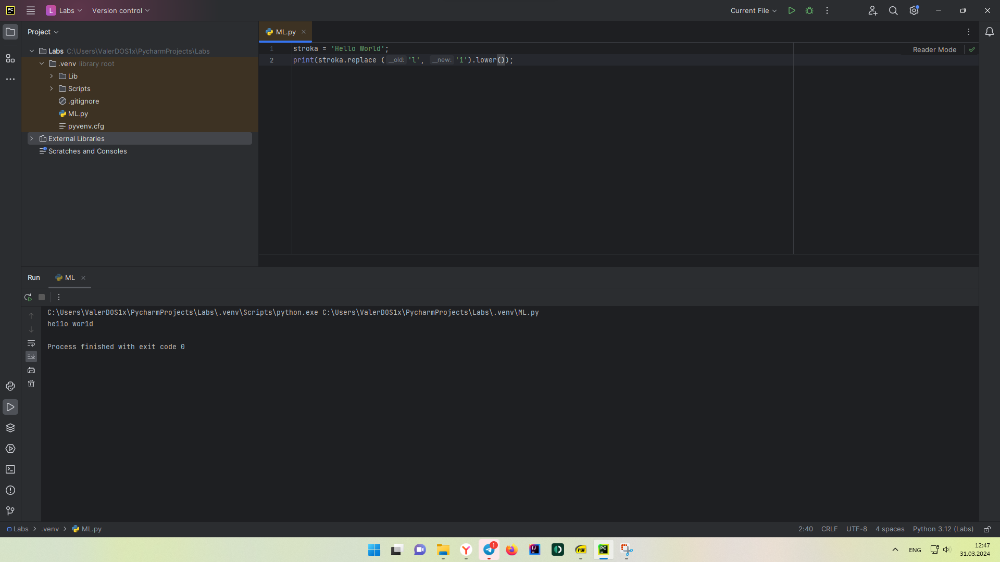

Отчет по Теме #2 выполнил:
- Стаценко Валерий Олегович
- ИНО ЗБ ПОАС-22-2

| Задание | Сам_раб |
| ------ | ------ |
| Задание 1 | + |
| Задание 2 | + |
| Задание 3 | + |
| Задание 4 | + |
| Задание 5 | + |
| Задание 6 | + |
| Задание 7 | + |
| Задание 8 | + |
| Задание 9 | + |
| Задание 10 | + |

знак "+" - задание выполнено; знак "-" - задание не выполнено;

Работу проверили:
- к.э.н., доцент Панов М.А.

## Самостоятельная работа №1
### Выведите в консоль булевую переменную False, не используя слово False в строке или изначально присвоенную булевую переменную. Программа должна занимать не более двух строк редактора кода.

```python
a = 0;
print(bool(a));
```

### Результат


  
## Самостоятельная работа №2
### Присвоить значения трем переменным и вывести их в консоль, используя только две строки редактора кода

```python
x=0; y=1; z=2;
print(x, y, z);
```

### Результат


  
## Самостоятельная работа №3
### Реализуйте ввод данных в программу, через консоль, в виде только целых чисел (тип данных int). То есть при вводе буквенных символов в консоль, программа не должна работать. Программа должна занимать не более двух строк редактора кода.

```python
num = int(input('Введите целое число: '))
print(num)
```

  ### Результат


  
## Самостоятельная работа №4
### Создайте только одну строковую переменную. Длина строки должна не превышать 5 символов. На выходе мы должны получить строку длиной не менее 16 символов. Программа должна занимать не более двух строк редактора кода.
  
```python
stroka = 'line';
print(stroka * 4);
```

### Результат


  
## Самостоятельная работа №5
### Создайте три переменные: день (тип данных - числовой), месяц (тип данных - строка), год (тип данных - числовой) и выведите в консоль текущую дату в формате: "Сегодня день месяц год. Всего хорошего!" используя F строку и оператор end внутри print(), в котором вы должны написать фразу "Всего хорошего!". Программа должна занимать не более двух строк редактора кода.
  
```python
day = 31; month = 'Март'; year = 2024;
print(f"Сегодня день {day}, месяц {month}, год {year}", end='. \nВсего хорошего!');
```

### Результат


  
## Самостоятельная работа №6
### В предложении 'Hello World' вставьте 'my' между двумя словами. Выведите полученное предложение в консоль в одну строку. Программа должна занимать не более двух строк редактора кода.

```python
stroka = 'Hello World';
print(stroka[0:5], "my", stroka[6:11]);
```

### Результат


  
## Самостоятельная работа №7
### Узнайте длину предложения 'Hello World', результат выведите в консоль. Программа занимать не более двух строк редактора кода.

```python
stroka = len('Hello World');
print(stroka);
```

### Результат


## Самостоятельная работа №8
### Переведите предложение 'HELLO WORLD' в нижний регистр. Программа должна занимать не более двух строк редактора кода.

```python
stroka = 'HELLO WORLD'
print(stroka.lower())
```

### Результат


  
## Самостоятельная работа №9
### Самостоятельно придумайте задачу по проходимой теме и решите ее. Задача должна быть связанна со взаимодействием с числовыми значениями.
#### Напишите программу на Python, которая принимает два числа (a и b) от пользователя и выводит сумму, разность, произведение и частное этих чисел.

```python
a = int(input('Введите первое число: '))
b = int(input('Введите второе число: '))
print(f'Результат сложения: {a+b}')
print(f'Результат разности: {a-b}')
print(f'Результат произведения: {a*b}')
print(f'Результат деления: {a/b}')
```

### Результат


## Самостоятельная работа №10
### Самостоятельно придумайте задачу по проходимой теме и решите ее. Задача должна быть связанна со взаимодействием со строковыми значениями.
#### Заменить в строке "Hello World" все буквы "l" на '1' и сделать строку в нижнем регистре. Программа должна занимать не более двух строк редактора кода.

```python
stroka = 'Hello World';
print(stroka.replace('l', '1').lower());
```

### Результат


