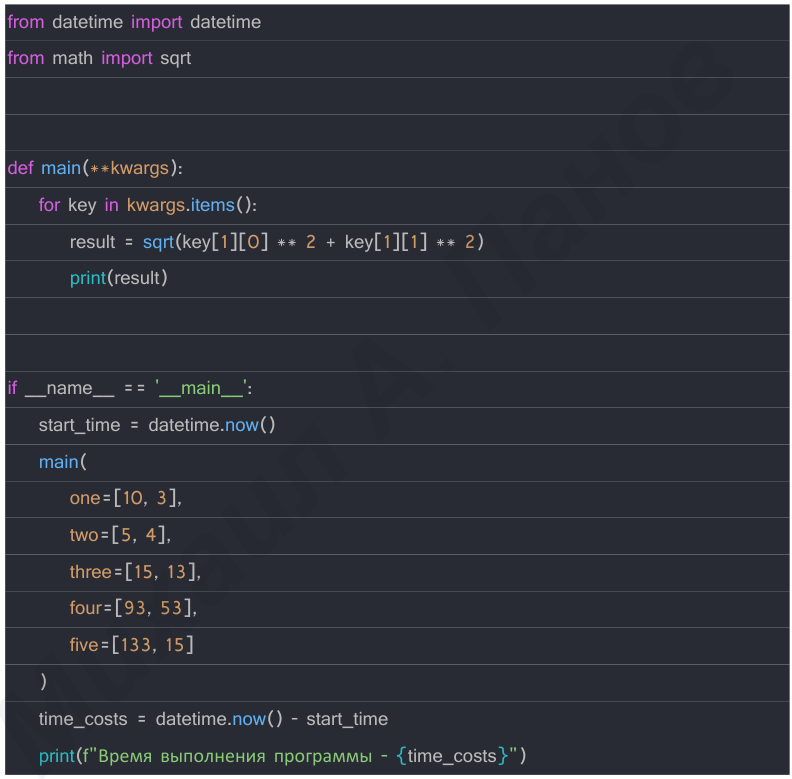
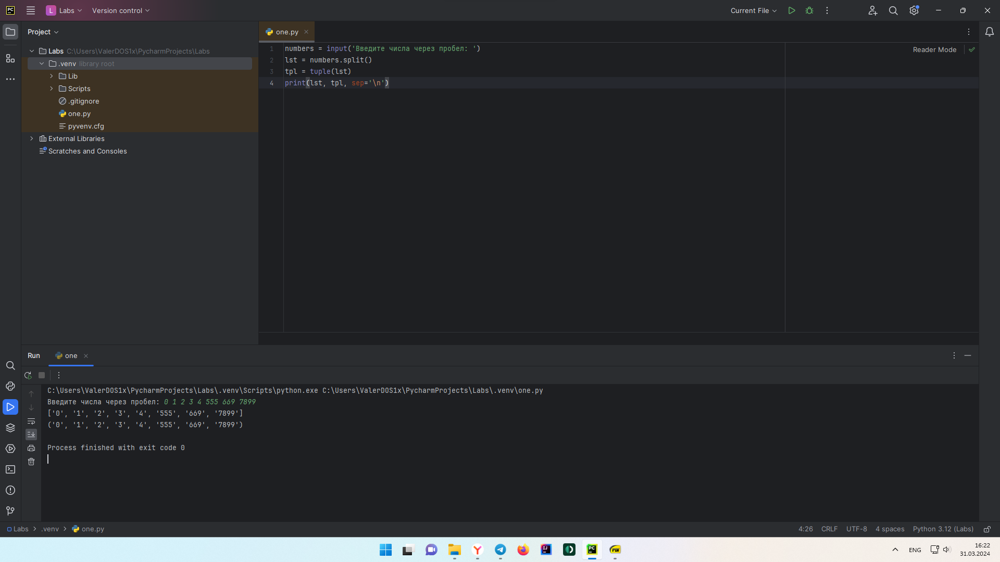
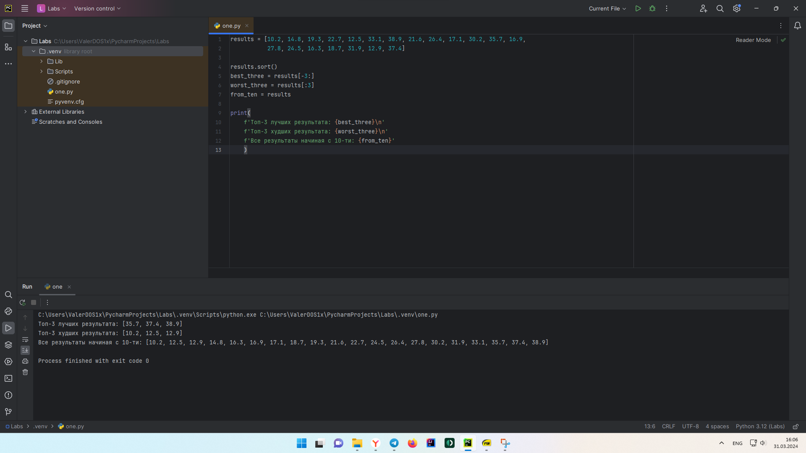
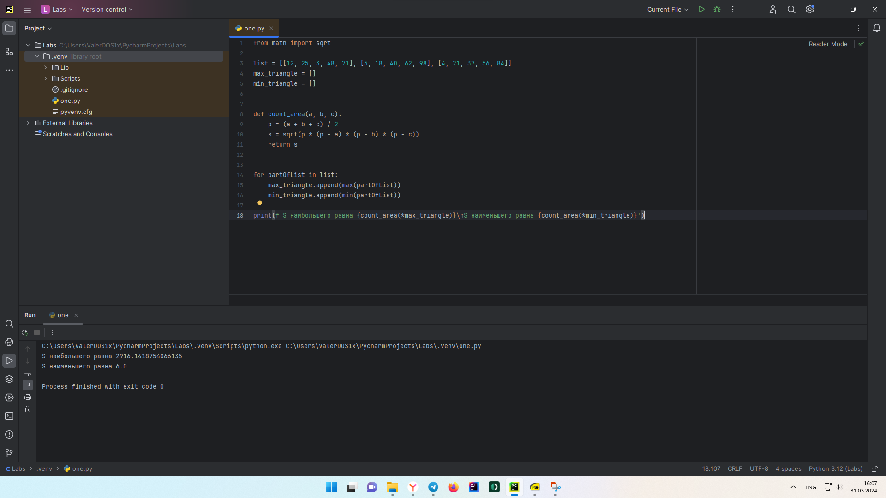
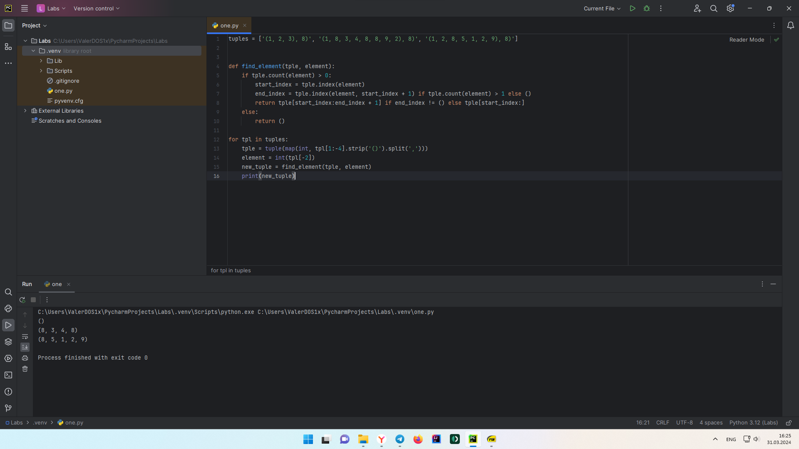
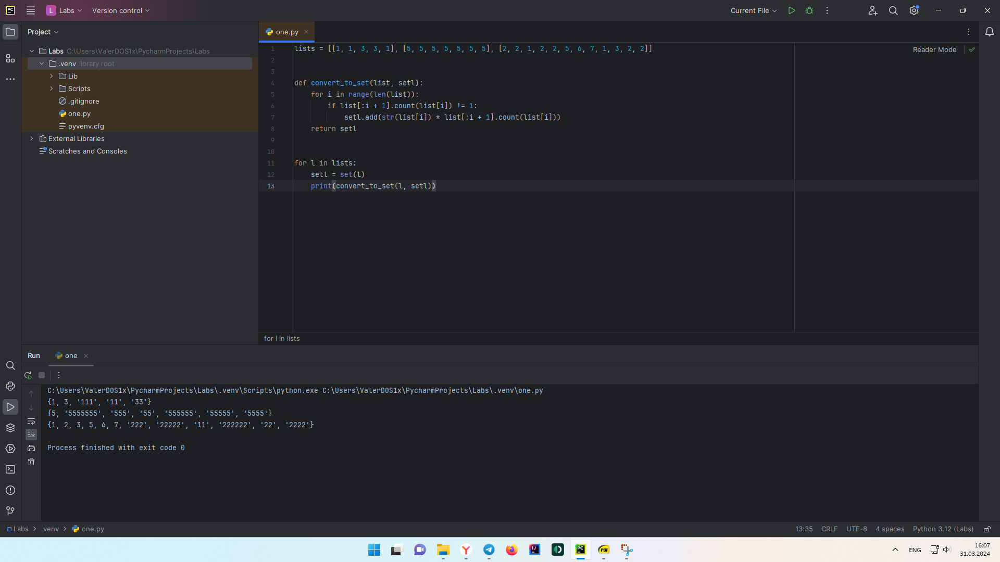

Отчет по Теме #4 выполнил:
- Стаценко Валерий Олегович
- ИНО ЗБ ПОАС-22-2

| Задание | Сам_раб |
| ------ | ------ |
| Задание 1 | + |
| Задание 2 | + |
| Задание 3 | + |
| Задание 4 | + |
| Задание 5 | + |

знак "+" - задание выполнено; знак "-" - задание не выполнено;

Работу проверили:
- к.э.н., доцент Панов М.А.

## Самостоятельная работа №1
Дайте подробный комментарий для кода, написанного ниже.
Комментарий нужен для каждой строчки кода, нужно описать что она
делает. Не забудь те, что функции комментируются по-особенному.


```python
from datetime import datetime
from math import sqrt
def main(**kwargs):
    """
    result - Возвращает квадратный корень суммы квадратов двух элементов кортежей

    :param kwargs: Принимаемые кортежи

    :rtype: float
    :return: Печатает result в консоли
    """
    for key in kwargs.items():
        result = sqrt(key[1][0] ** 2 + key[1][1] ** 2)
        print(result)
if __name__ == '__main__':  # точка входа
    start_time = datetime.now()  # фиксация начала времени

    # запуск функции main и передача параметров kwargs
    main(
        one=[10, 3],
        two=[5, 4],
        three=[15, 13],
        four=[93, 53],
        five=[133, 15]
    )
    # подсчёт сколько времени заняло выполнение программы. Сейчас - начало времени
    time_costs = datetime.now() - start_time
    # Выводит в консоль сколько времени выполнялась программа
    print(f"Время выполнения программы - {time_costs}")
```

### Результат


  
## Самостоятельная работа №2
Напишите программу, которая будет заменять игральную кость с 6
гранями. Если значение равно 5 или 6, то в консоль выводится «Вы
победили», если значения 3 или 4, то вы рекурсивно должны вызвать
эту же функцию, если значение 1 или 2, то в консоль выводится «Вы
проиграли». При этом каждый вызов функции необходимо выводить в
консоль значение “кубика”. Для выполнения задания необходимо
Михаил А. Панов
использовать стандартную библиотеку random. Программу нужно
написать, используя одну функцию и “точку входа”

```python
import random


def dice():
    roll = random.randrange(1, 6)
    print(f'Выпало - {roll}')
    if roll >= 5:
        print('Вы победили')
    elif 3 <= roll <= 4:
        dice()
    elif 1 <= roll <= 2:
        print('Вы проиграли')


if __name__ == '__main__':
    dice()
```

### Результат


  
## Самостоятельная работа №3
Напишите программу, которая будет выводить текущее время, с
точностью до секунд на протяжении 5 секунд. Программу нужно
написать с использованием цикла. Подсказка: необходимо
использовать модуль datetime и time, а также вам необходимо как-то
“усыплять” программу на 1 секунду.

```python
from datetime import datetime as dt
import time as t


def time(start):
    print(dt.now().time())
    return dt.now().time().second - start


sec = 0
time_start = dt.now().time().second
while sec <= 5:
    t.sleep(1)
    sec = time(time_start)
```

  ### Результат



  
## Самостоятельная работа №4
Напишите программу, которая считает среднее арифметическое от
аргументов вызываемое функции, с условием того, что изначальное
количество этих аргументов неизвестно. Программу необходимо
реализовать используя одну функцию и “точку входа”
  
```python
def mean(data):
    return sum(data) / float(len(data))


def main(**kwargs):
    for i, j in kwargs.items():
        print(f"{i}) Среднее арифметическое = {mean(j)}")


if __name__ == '__main__':
    main(
        a=[2, 8, 6],
        b=[3, 5, 7, 9]
    )
```

### Результат


  
## Самостоятельная работа №5
Создайте два Python файла, в одном будет выполняться вычисление
площади треугольника при помощи формулы Герона (необходимо
реализовать через функцию), а во втором будет происходить
взаимодействие с пользователем (получение всей необходимой
информации и вывод результатов). Напишите эту программу и
выведите в консоль полученную площадь.
  
```python
import S5_module as m

a = int(input('A = '))
b = int(input('B = '))
c = int(input('C = '))

print('S =', m.triangle(a, b, c))
```
```python
from math import sqrt


def triangle(a, b, c):
    p = (a+b+c)/2
    return sqrt(p*(p-a)*(p-b)*(p-c))
```

### Результат


 
