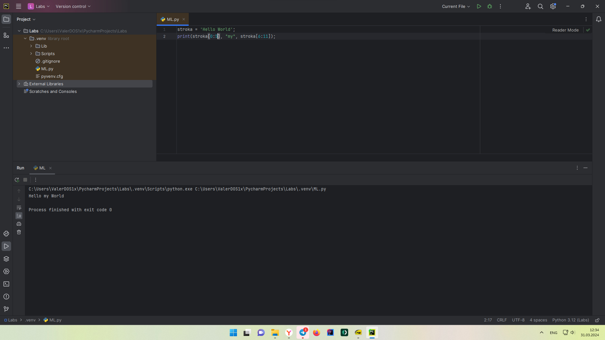
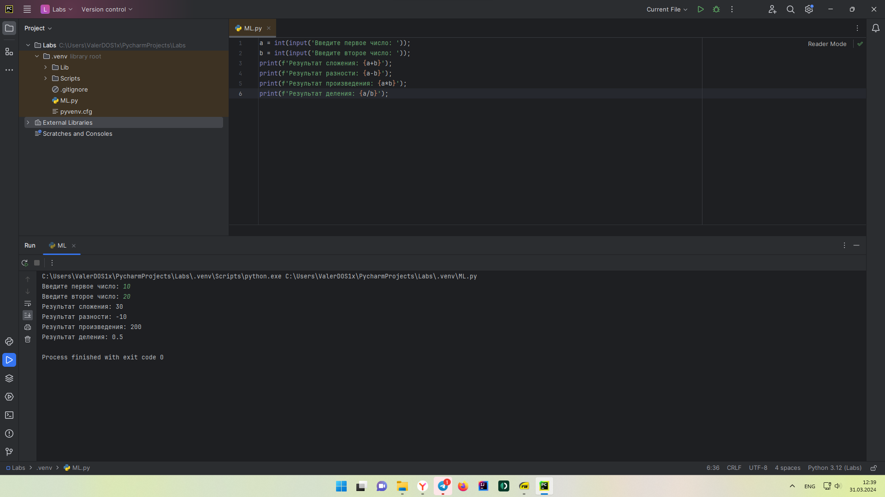

Отчет по Теме #4 выполнил:
- Стаценко Валерий Олегович
- ИНО ЗБ ПОАС-22-2

| Задание | Сам_раб |
| ------ | ------ |
| Задание 1 | + |
| Задание 2 | + |
| Задание 3 | + |
| Задание 4 | + |
| Задание 5 | + |
| Задание 6 | + |
| Задание 7 | + |
| Задание 8 | + |
| Задание 9 | + |
| Задание 10 | + |

знак "+" - задание выполнено; знак "-" - задание не выполнено;

Работу проверили:
- к.э.н., доцент Панов М.А.

## Самостоятельная работа №1
Дайте подробный комментарий для кода, написанного ниже.
Комментарий нужен для каждой строчки кода, нужно описать что она
делает. Не забудь те, что функции комментируются по-особенному.


```python
from datetime import datetime
from math import sqrt
def main(**kwargs):
    """
    result - Возвращает квадратный корень суммы квадратов двух элементов кортежей

    :param kwargs: Принимаемые кортежи

    :rtype: float
    :return: Печатает result в консоли
    """
    for key in kwargs.items():
        result = sqrt(key[1][0] ** 2 + key[1][1] ** 2)
        print(result)
if __name__ == '__main__':  # точка входа
    start_time = datetime.now()  # фиксация начала времени

    # запуск функции main и передача параметров kwargs
    main(
        one=[10, 3],
        two=[5, 4],
        three=[15, 13],
        four=[93, 53],
        five=[133, 15]
    )
    # подсчёт сколько времени заняло выполнение программы. Сейчас - начало времени
    time_costs = datetime.now() - start_time
    # Выводит в консоль сколько времени выполнялась программа
    print(f"Время выполнения программы - {time_costs}")
```

### Результат


  
## Самостоятельная работа №2
Напишите программу, которая будет заменять игральную кость с 6
гранями. Если значение равно 5 или 6, то в консоль выводится «Вы
победили», если значения 3 или 4, то вы рекурсивно должны вызвать
эту же функцию, если значение 1 или 2, то в консоль выводится «Вы
проиграли». При этом каждый вызов функции необходимо выводить в
консоль значение “кубика”. Для выполнения задания необходимо
Михаил А. Панов
использовать стандартную библиотеку random. Программу нужно
написать, используя одну функцию и “точку входа”

```python
import random


def dice():
    roll = random.randrange(1, 6)
    print(f'Выпало - {roll}')
    if roll >= 5:
        print('Вы победили')
    elif 3 <= roll <= 4:
        dice()
    elif 1 <= roll <= 2:
        print('Вы проиграли')


if __name__ == '__main__':
    dice()
```

### Результат


  
## Самостоятельная работа №3
Напишите программу, которая будет выводить текущее время, с
точностью до секунд на протяжении 5 секунд. Программу нужно
написать с использованием цикла. Подсказка: необходимо
использовать модуль datetime и time, а также вам необходимо как-то
“усыплять” программу на 1 секунду.

```python
num = int(input('Введите целое число: '))
print(num)
```

  ### Результат


  
## Самостоятельная работа №4
### Создайте только одну строковую переменную. Длина строки должна не превышать 5 символов. На выходе мы должны получить строку длиной не менее 16 символов. Программа должна занимать не более двух строк редактора кода.
  
```python
stroka = 'line';
print(stroka * 4);
```

### Результат


  
## Самостоятельная работа №5
### Создайте три переменные: день (тип данных - числовой), месяц (тип данных - строка), год (тип данных - числовой) и выведите в консоль текущую дату в формате: "Сегодня день месяц год. Всего хорошего!" используя F строку и оператор end внутри print(), в котором вы должны написать фразу "Всего хорошего!". Программа должна занимать не более двух строк редактора кода.
  
```python
day = 31; month = 'Март'; year = 2024;
print(f"Сегодня день {day}, месяц {month}, год {year}", end='. \nВсего хорошего!');
```

### Результат


  
## Самостоятельная работа №6
### В предложении 'Hello World' вставьте 'my' между двумя словами. Выведите полученное предложение в консоль в одну строку. Программа должна занимать не более двух строк редактора кода.

```python
stroka = 'Hello World';
print(stroka[0:5], "my", stroka[6:11]);
```

### Результат


  
## Самостоятельная работа №7
### Узнайте длину предложения 'Hello World', результат выведите в консоль. Программа занимать не более двух строк редактора кода.

```python
stroka = len('Hello World');
print(stroka);
```

### Результат


## Самостоятельная работа №8
### Переведите предложение 'HELLO WORLD' в нижний регистр. Программа должна занимать не более двух строк редактора кода.

```python
stroka = 'HELLO WORLD'
print(stroka.lower())
```

### Результат


  
## Самостоятельная работа №9
### Самостоятельно придумайте задачу по проходимой теме и решите ее. Задача должна быть связанна со взаимодействием с числовыми значениями.
#### Напишите программу на Python, которая принимает два числа (a и b) от пользователя и выводит сумму, разность, произведение и частное этих чисел.

```python
a = int(input('Введите первое число: '))
b = int(input('Введите второе число: '))
print(f'Результат сложения: {a+b}')
print(f'Результат разности: {a-b}')
print(f'Результат произведения: {a*b}')
print(f'Результат деления: {a/b}')
```

### Результат



## Самостоятельная работа №10
### Самостоятельно придумайте задачу по проходимой теме и решите ее. Задача должна быть связанна со взаимодействием со строковыми значениями.
#### Заменить в строке "Hello World" все буквы "l" на '1' и сделать строку в нижнем регистре. Программа должна занимать не более двух строк редактора кода.

```python
stroka = 'Hello World';
print(stroka.replace('l', '1').lower());
```

### Результат


