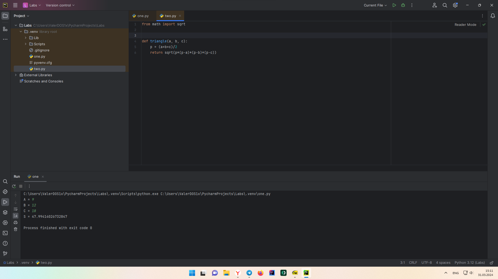

Отчет по Теме #5 выполнил:
- Стаценко Валерий Олегович
- ИНО ЗБ ПОАС-22-2

| Задание | Сам_раб |
| ------ | ------ |
| Задание 1 | + |
| Задание 2 | + |
| Задание 3 | + |
| Задание 4 | + |
| Задание 5 | + |

знак "+" - задание выполнено; знак "-" - задание не выполнено;

Работу проверили:
- к.э.н., доцент Панов М.А.

## Самостоятельная работа №1
Ресторан на предприятии ведет учет посещений за неделю при помощи
кода работника. У них есть список со всеми посещениями за неделю.
Ваша задача почитать:
• Сколько было выдано чеков
• Сколько разных людей посетило ресторан
• Какой работник посетил ресторан больше всех раз
Список выданных чеков за неделю:
[8734, 2345, 8201, 6621, 9999, 1234, 5678, 8201, 8888, 4321, 3365,
1478, 9865, 5555, 7777, 9998, 1111, 2222, 3333, 4444, 5556, 6666,
5410, 7778, 8889, 4445, 1439, 9604, 8201, 3365, 7502, 3016, 4928,
5837, 8201, 2643, 5017, 9682, 8530, 3250, 7193, 9051, 4506, 1987,
3365, 5410, 7168, 7777, 9865, 5678, 8201, 4445, 3016, 4506, 4506]
Результатом выполнения задачи будет: листинг кода, и вывод в
консоль, в котором будет указана вся необходимая информация.

```python
from datetime import datetime
from math import sqrt
def main(**kwargs):
    """
    result - Возвращает квадратный корень суммы квадратов двух элементов кортежей

    :param kwargs: Принимаемые кортежи

    :rtype: float
    :return: Печатает result в консоли
    """
    for key in kwargs.items():
        result = sqrt(key[1][0] ** 2 + key[1][1] ** 2)
        print(result)
if __name__ == '__main__':  # точка входа
    start_time = datetime.now()  # фиксация начала времени

    # запуск функции main и передача параметров kwargs
    main(
        one=[10, 3],
        two=[5, 4],
        three=[15, 13],
        four=[93, 53],
        five=[133, 15]
    )
    # подсчёт сколько времени заняло выполнение программы. Сейчас - начало времени
    time_costs = datetime.now() - start_time
    # Выводит в консоль сколько времени выполнялась программа
    print(f"Время выполнения программы - {time_costs}")
```

### Результат


  
## Самостоятельная работа №2
На физкультуре студенты сдавали бег, у преподавателя физкультуры
есть список всех результатов, ему нужно узнать
• Три лучшие результата
• Три худшие результата
• Все результаты начиная с 10
Ваша задача помочь ему в этом.
Список результатов бега:
[10.2, 14.8, 19.3, 22.7, 12.5, 33.1, 38.9, 21.6, 26.4, 17.1, 30.2, 35.7, 16.9,
27.8, 24.5, 16.3, 18.7, 31.9, 12.9, 37.4]
Результатом выполнения задачи будет: листинг кода, и вывод в
консоль, в котором будет указана вся необходимая информация.

```python
import random


def dice():
    roll = random.randrange(1, 6)
    print(f'Выпало - {roll}')
    if roll >= 5:
        print('Вы победили')
    elif 3 <= roll <= 4:
        dice()
    elif 1 <= roll <= 2:
        print('Вы проиграли')


if __name__ == '__main__':
    dice()
```

### Результат


  
## Самостоятельная работа №3
Преподаватель по математике придумал странную задачку. У вас есть
три списка с элементами, каждый элемент которых – длина стороны
треугольника, ваша задача найти площади двух треугольников,
составленные из максимальных и минимальных элементов полученных
списков. Результатом выполнения задачи будет: листинг кода, и вывод
в консоль, в котором будут указаны два этих значения.
Три списка:
one = [12, 25, 3, 48, 71]
two = [5, 18, 40, 62, 98]
three = [4, 21, 37, 56, 84]

```python
from datetime import datetime as dt
import time as t


def time(start):
    print(dt.now().time())
    return dt.now().time().second - start


sec = 0
time_start = dt.now().time().second
while sec <= 5:
    t.sleep(1)
    sec = time(time_start)
```

  ### Результат


  
## Самостоятельная работа №4
Никто не любит получать плохие оценки, поэтому Борис решил это
исправить. Допустим, что все оценки студента за семестр хранятся в
одном списке. Ваша задача удалить из этого списка все двойки, а все
тройки заменить на четверки.
Списки оценок (проверить работу программы на всех трех вариантах):
[2, 3, 4, 5, 3, 4, 5, 2, 2, 5, 3, 4, 3, 5, 4]
[4, 2, 3, 5, 3, 5, 4, 2, 2, 5, 4, 3, 5, 3, 4]
[5, 4, 3, 3, 4, 3, 3, 5, 5, 3, 3, 3, 3, 4, 4]
Результатом выполнения задачи будет: листинг кода, и вывод в
консоль, в котором будут три обновленных массива.
  
```python
def mean(data):
    return sum(data) / float(len(data))


def main(**kwargs):
    for i, j in kwargs.items():
        print(f"{i}) Среднее арифметическое = {mean(j)}")


if __name__ == '__main__':
    main(
        a=[2, 8, 6],
        b=[3, 5, 7, 9]
    )
```

### Результат


  
## Самостоятельная работа №5
Вам предоставлены списки натуральных чисел, из них необходимо
сформировать множества. При этом следует соблюдать это правило:
если какое-либо число повторяется, то преобразовать его в строку по
следующему образцу: например, если число 4 повторяется 3 раза, то в
множестве будет следующая запись: само число 4, строка «44», строка
«444».
Множества для теста:
list_1 = [1, 1, 3, 3, 1]
list_2 = [5, 5, 5, 5, 5, 5, 5]
list_3 = [2, 2, 1, 2, 2, 5, 6, 7, 1, 3, 2, 2]
Результаты вывода (порядок может отличаться, поскольку мы работаем
с set()):
{'11', 1, 3, '33', '111'}
{5, '5555', '555555', '55555', '555', '55', '5555555'}
{'11', 1, 3, 2, 5, 6, '222222', '222', 7, '2222', '22222', '22'}
  
```python
import two as m

a = int(input('A = '))
b = int(input('B = '))
c = int(input('C = '))

print('S =', m.triangle(a, b, c))
```
```python
from math import sqrt


def triangle(a, b, c):
    p = (a+b+c)/2
    return sqrt(p*(p-a)*(p-b)*(p-c))
```

### Результат




