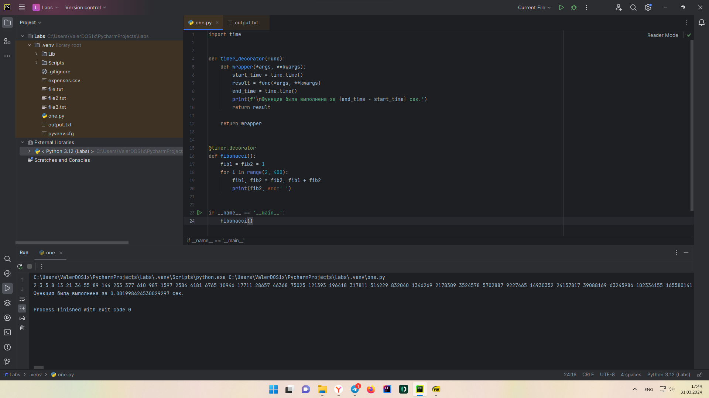
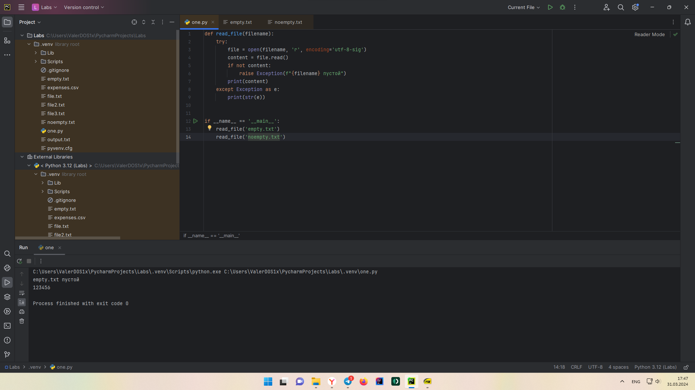
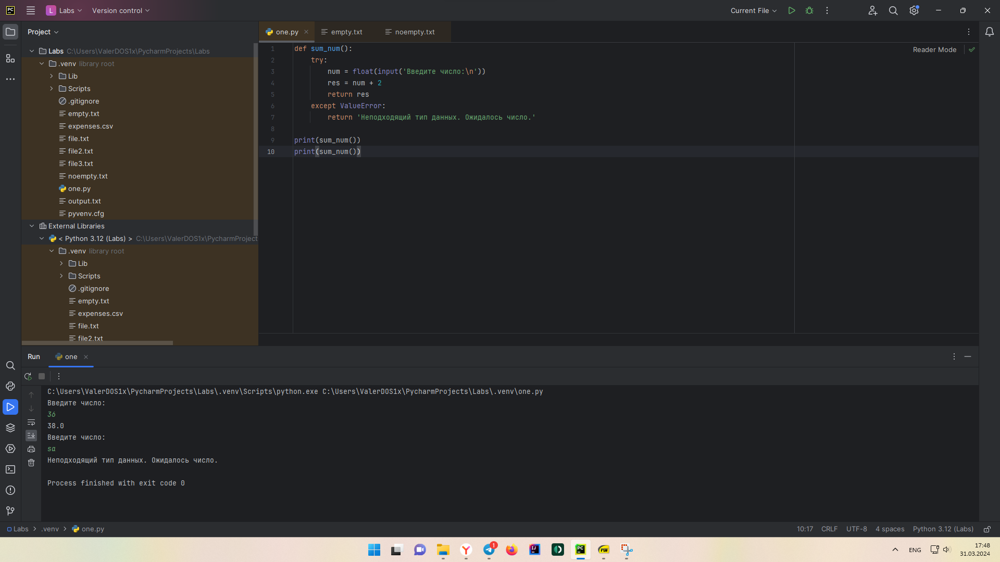
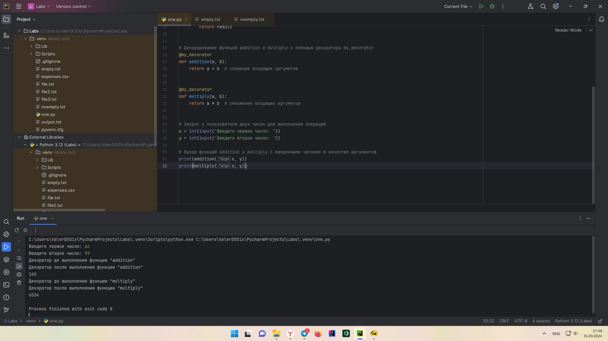
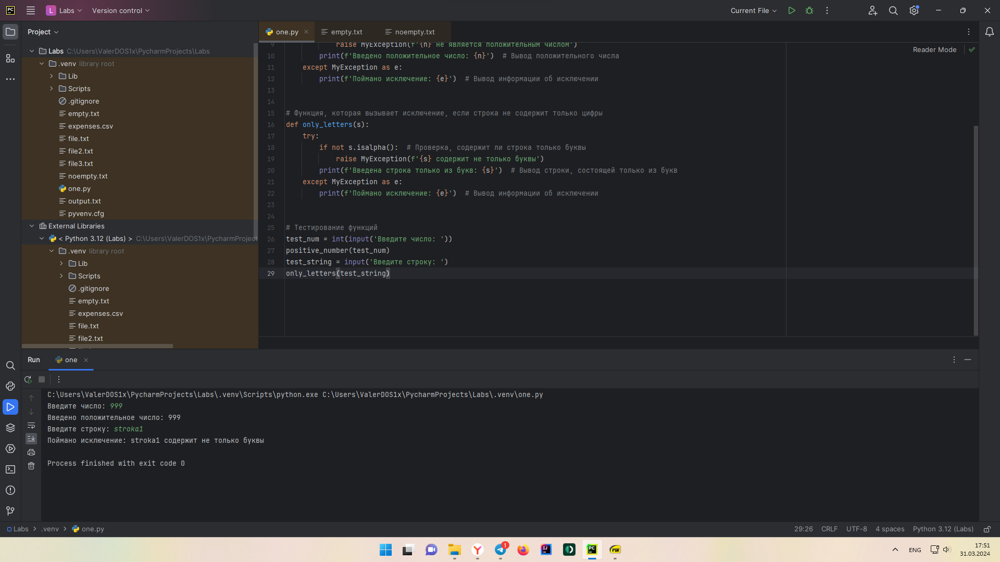

Отчет по Теме #6 выполнил:
- Стаценко Валерий Олегович
- ИНО ЗБ ПОАС-22-2

| Задание | Сам_раб |
| ------ | ------ |
| Задание 1 | + |
| Задание 2 | + |
| Задание 3 | + |
| Задание 4 | + |
| Задание 5 | + |

знак "+" - задание выполнено; знак "-" - задание не выполнено;

Работу проверили:
- к.э.н., доцент Панов М.А.

## Самостоятельная работа №1
При создании сайта у вас возникла потребность обрабатывать
данные пользователя в странной форме, а потом переводить их в
нужные вам форматы. Вы хотите принимать от пользователя
последовательность чисел, разделенных пробелом, а после
переформатировать эти данные в список и кортеж. Реализуйте вашу
задумку. Для получения начальных данных используйте input().
Результатом программы будет выведенный список и кортеж из
начальных данных.

```python
numbers = input('Введите числа через пробел: ')
lst = numbers.split()
tpl = tuple(lst)
print(lst, tpl, sep='\n')
```

### Результат


  
## Самостоятельная работа №2
Николай знает, что кортежи являются неизменяемыми, но он очень
упрямый и всегда хочет доказать, что он прав. Студент решил
создать функцию, которая будет удалять первое появление
определенного элемента из кортежа по значению и возвращать
кортеж без него. Попробуйте повторить шедевр не признающего
авторитеты начинающего программиста. Но учтите, что Николай не
всегда уверен в наличии элемента в кортеже (в этом случае кортеж
вернется функцией в исходном виде).
Входные данные:
(1, 2, 3), 1)
(1, 2, 3, 1, 2, 3, 4, 5, 2, 3, 4, 2, 4, 2), 3)
(2, 4, 6, 6, 4, 2), 9)
Ожидаемый результат:
(2, 3)
(1, 2, 1, 2, 3, 4, 5, 2, 3, 4, 2, 4, 2)
(2, 4, 6, 6, 4, 2)

```python
tuples = ['(1, 2, 3), 1)', '(1, 2, 3, 1, 2, 3, 4, 5, 2, 3, 4, 2, 4, 2), 3)', '(2, 4, 6, 6, 4, 2), 9)']


def remove_element(tpl, el):
    lst = list(tpl)
    if el in lst:
        lst.remove(el)
        return tuple(lst)
    else:
        return tpl


for tple in tuples:
    tpl = tuple(map(int, tple[:-4].strip('()').split(',')))
    element = int(tpl[-2:-1][0])
    new_tuple = remove_element(tpl, element)
    print(new_tuple)
```

### Результат


  
## Самостоятельная работа №3
Ребята поспорили кто из них одним нажатием на numpad наберет
больше повторяющихся цифр, но не понимают, как узнать
победителя. Вам им нужно в этом помочь. Дана строка в виде
случайной последовательности чисел от 0 до 9 (длина строки
минимум 15 символов). Требуется создать словарь, который в
качестве ключей будет принимать данные числа (т. е. ключи будут
типом int), а в качестве значений – количество этих чисел в
имеющейся последовательности. Для построения словаря создайте
функцию, принимающую строку из цифр. Функция должна
возвратить словарь из 3-х самых часто встречаемых чисел, также
эти значения нужно вывести в порядке возрастания ключа.

```python
nums = input('Нажмите ладонью на numpad один раз\n')


def count_numbers(string):
    num_freq = {}

    for i in string:
        i = int(i)
        num_freq[i] = num_freq.get(i, 0) + 1

    sorted_num_freq = sorted(num_freq.items(), key=lambda item: item[1])
    top_three = dict(sorted(sorted_num_freq[-3:]))
    return top_three


print(count_numbers(nums))
```

  ### Результат


  
## Самостоятельная работа №4
Ваш хороший друг владеет офисом со входом по электронным
картам, ему нужно чтобы вы написали программу, которая
показывала в каком порядке сотрудники входили и выходили из
офиса. Определение сотрудника происходит по id. Напишите
функцию, которая на вход принимает кортеж и случайный элемент
(id), его можно придумать самостоятельно. Требуется вернуть
новый кортеж, начинающийся с первого появления элемента в нем и
заканчивающийся вторым его появлением включительно.
Если элемента нет вовсе – вернуть пустой кортеж.
Если элемент встречается только один раз, то вернуть кортеж,
который начинается с него и идет до конца исходного.
Входные данные:
(1, 2, 3), 8)
(1, 8, 3, 4, 8, 8, 9, 2), 8)
(1, 2, 8, 5, 1, 2, 9), 8)
Ожидаемый результат:
()
(8, 3, 4, 8)
(8, 5, 1, 2, 9)
  
```python
tuples = ['(1, 2, 3), 8)', '(1, 8, 3, 4, 8, 8, 9, 2), 8)', '(1, 2, 8, 5, 1, 2, 9), 8)']


def find_element(tple, element):
    if tple.count(element) > 0:
        start_index = tple.index(element)
        end_index = tple.index(element, start_index + 1) if tple.count(element) > 1 else ()
        return tple[start_index:end_index + 1] if end_index != () else tple[start_index:]
    else:
        return ()

for tpl in tuples:
    tple = tuple(map(int, tpl[1:-4].strip('()').split(',')))
    element = int(tpl[-2])
    new_tuple = find_element(tple, element)
    print(new_tuple)
```

### Результат


  
## Самостоятельная работа №5
Самостоятельно придумайте и решите задачу, в которой будут
обязательно использоваться кортеж или список. Проведите
минимум три теста для проверки работоспособности вашей задачи
  
```python
# В магазине продаются яблоки разных сортов.
# На складе имеется информация о количестве яблок каждого сорта,
# и их средней цене. Необходимо посчитать общую стоимость всех яблок на складе.

apples_info = [('Голден', 100), ('Сезонные', 50), ('Медовые', 75)] # Тип яблока и кол-во на складе
apples_prices = {'Голден': 127, 'Сезонные': 79, 'Медовые': 98} # Тип яблока и средняя цена

total_cost = 0

for apple_type, counts in apples_info:
    apple_price = apples_prices[apple_type]
    total_cost += counts * apple_price

print(f"Общая стоимость всех яблок на складе: {total_cost} рублей.")
```

### Результат



