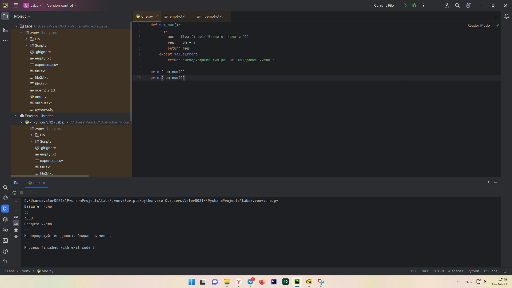

Отчет по Теме #7 выполнил:
- Стаценко Валерий Олегович
- ИНО ЗБ ПОАС-22-2

| Задание | Сам_раб |
| ------ | ------ |
| Задание 1 | + |
| Задание 2 | + |
| Задание 3 | + |
| Задание 4 | + |
| Задание 5 | + |

знак "+" - задание выполнено; знак "-" - задание не выполнено;

Работу проверили:
- к.э.н., доцент Панов М.А.

## Самостоятельная работа №1
Найдите в интернете любую статью (объем статьи не менее 200
слов), скопируйте ее содержимое в файл и напишите программу,
которая считает количество слов в текстовом файле и определит
самое часто встречающееся слово. Результатом выполнения задачи
будет: скриншот файла со статьей, листинг кода, и вывод в консоль,
в котором будет указана вся необходимая информация

```python
import re

file = open('file.txt', 'r', encoding='utf-8-sig')
words = file.read().split()
stopwords = ['в', 'на', 'и', 'с', 'к', 'а']
print(f'Длина статьи: {len(words)} слов.')


def clean_text(words, stopwords):
    words = [re.sub(r'[,()."—:«»]', '', i) for i in words if i not in stopwords and len(i) > 1]
    return words


def find_most_frequent(words):
    words = clean_text(words, stopwords)
    num_freq = {}
    for word in words:
        num_freq[word] = num_freq.get(word, 0) + 1
    sorted_num_freq = sorted(num_freq.items(), key=lambda item: item[1])
    top = sorted_num_freq[-1]
    return top


res = find_most_frequent(words)
print(f'Самое встречающееся слово: "{res[0]}". Встречается {res[1]} раз.')

file.close()
```

### Результат


  
## Самостоятельная работа №2
У вас появилась потребность в ведении книги расходов, посмотрев
все существующие варианты вы пришли к выводу что вас ничего не
устраивает и нужно все делать самому. Напишите программу для
учета расходов. Программа должна позволять вводить информацию
о расходах, сохранять ее в файл и выводить существующие данные в
консоль. Ввод информации происходит через консоль. Результатом
выполнения задачи будет: скриншот файла с учетом расходов,
листинг кода, и вывод в консоль, с демонстрацией
работоспособности программы

```python
import csv

def record_expenses(expenses):
    date = input('Введите дату: ')
    category = input('Введите категорию: ')
    amount = float(input('Введите сумму: '))
    expenses.append({'date': date, 'category': category, 'amount': amount})
    with open('expenses.csv', 'a', newline='') as file:
        fieldnames = ['date', 'category', 'amount']
        writer = csv.DictWriter(file, fieldnames=fieldnames)
        if file.tell() == 0:
            writer.writeheader()
        writer.writerow(expenses[-1])

def view_expenses(expenses):
    with open('expenses.csv', 'r', newline='') as file:
        reader = csv.DictReader(file)
        for row in reader:
            print(f"{row['date']}, {row['category']}, {row['amount']}")

expenses = []

while True:
    print('1. Добавить запись')
    print('2. Просмотреть записи')
    choice = int(input('Введите номер действия: '))

    if choice == 1:
        record_expenses(expenses)
    elif choice == 2:
        view_expenses(expenses)
        break
```

### Результат


  
## Самостоятельная работа №3
Имеется файл input.txt с текстом на латинице. Напишите программу,
которая выводит следующую статистику по тексту: количество букв
латинского алфавита; число слов; число строк.
• Текст в файле:
Beautiful is better than ugly.
Explicit is better than implicit.
Simple is better than complex.
Complex is better than complicated.
• Ожидаемый результат:
Input file contains:
108 letters
20 words
4 lines

```python
import re

file = open('file2.txt', 'r', encoding='utf-8-sig')

number_of_words = 0
number_of_lines = 0
number_of_characters = 0

for string in file:
    number_of_words += len(string.split())
    number_of_lines += 1
    for letter in string:
        number_of_characters += 1 if re.match(r'[a-zA-Z]+', letter) else 0

print('Input file contains:', f'{number_of_characters} letters', f'{number_of_words} words', f'{number_of_lines} lines',
      sep='\n')

file.close()
```

  ### Результат


  
## Самостоятельная работа №4
Напишите программу, которая получает на вход предложение,
выводит его в терминал, заменяя все запрещенные слова
звездочками * (количество звездочек равно количеству букв в
слове). Запрещенные слова, разделенные символом пробела,
хранятся в текстовом файле input.txt. Все слова в этом файле
записаны в нижнем регистре. Программа должна заменить
запрещенные слова, где бы они ни встречались, даже в середине
другого слова. Замена производится независимо от регистра: если
файл input.txt содержит запрещенное слово exam, то слова exam,
Exam, ExaM, EXAM и exAm должны быть заменены на ****.
• Запрещенные слова:
hello email python the exam wor is
• Предложение для проверки:
Hello, world! Python IS the programming language of thE future. My
EMAIL is....
PYTHON is awesome!!!!
• Ожидаемый результат:
*****, ***ld! ****** ** *** programming language of *** future. My
***** **....
****** ** awesome!!!!
  
```python
import re

file = open('file3.txt', 'r', encoding='utf-8-sig')
stopwords = file.read().split()
string = '''Hello, world! Python IS the programming language of thE future. My EMAIL is....
PYTHON is awesome!!!!'''


def censor_text(string, stopwords):
    for stopword in stopwords:
        string = re.sub(stopword, lambda x: '*' * len(x.group()), string, flags=re.IGNORECASE)
    return string


res = censor_text(string, stopwords)
print(res)

file.close()
```

### Результат


  
## Самостоятельная работа №5
Программа будет считывать ФИО пользователя, считать кол-во символов без пробелов, выводить сумму символов в консоль и делать запись в файл output.txt
  
```python
def count_characters_without_spaces(full_name):
    # Удаляем пробелы из строки и считаем количество символов
    characters_count = len(full_name.replace(" ", ""))
    return characters_count


def main():
    # Запрос ФИО у пользователя
    full_name = input("Введите ваше ФИО: ")

    # Считаем количество символов без пробелов
    characters_count = count_characters_without_spaces(full_name)

    # Выводим результат в консоль
    print(f"Сумма символов в ФИО без пробелов: {characters_count}")

    # Записываем результат в файл output.txt
    with open("output.txt", "w", encoding="utf-8") as file:
        file.write(f"ФИО: {full_name}\n")
        file.write(f"Сумма символов без пробелов: {characters_count}")


# Вызываем функцию main() для запуска программы
if __name__ == "__main__":
    main()
```

### Результат


