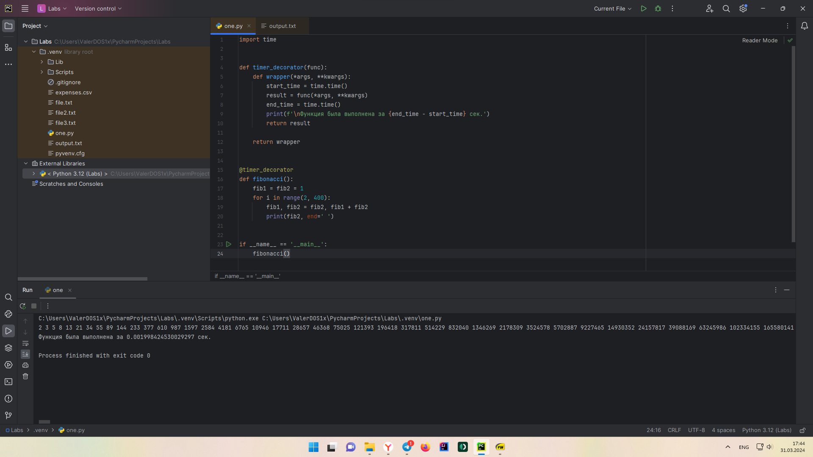
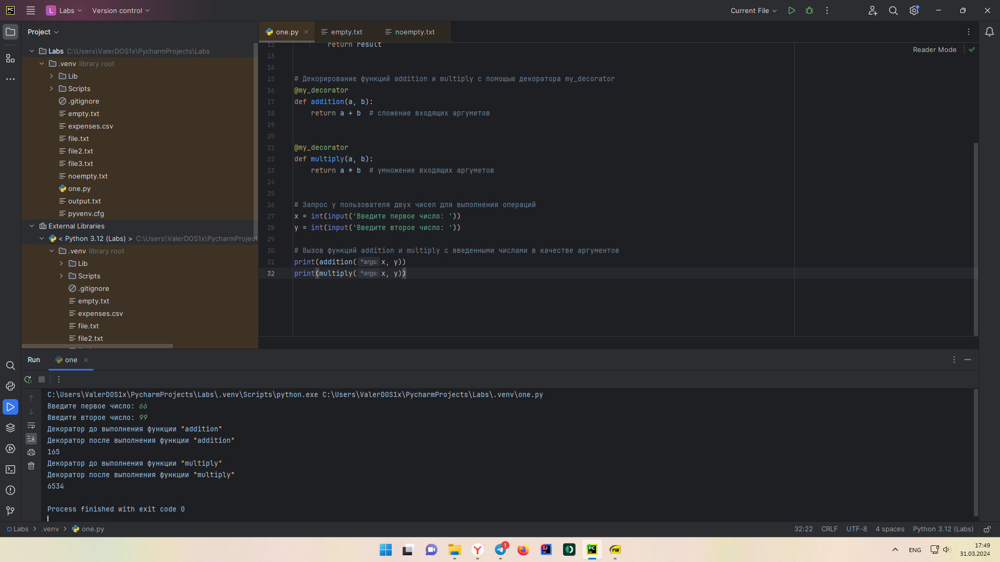

Отчет по Теме #8 выполнил:
- Стаценко Валерий Олегович
- ИНО ЗБ ПОАС-22-2

| Задание | Сам_раб |
| ------ | ------ |
| Задание 1 | + |
| Задание 2 | + |
| Задание 3 | + |
| Задание 4 | + |
| Задание 5 | + |

знак "+" - задание выполнено; знак "-" - задание не выполнено;

Работу проверили:
- к.э.н., доцент Панов М.А.

## Самостоятельная работа №1
Самостоятельно создайте класс и его объект. Они должны
отличаться, от тех, что указаны в теоретическом материале
(методичке) и лабораторных заданиях. Результатом выполнения
задания будет листинг кода и получившийся вывод консоли.

```python
class Person:
    def __init__(self, name, age, gender):
        self.name = name
        self.age = age
        self.gender = gender

    def show_info(self):
        print(f"Информация о человеке:\nИмя: {self.name}\nВозраст: {self.age}\nПол: {self.gender}")

    def greet(self):
        if self.gender == "муж":
            print(f"Здравствуйте, Г-н. {self.name}!\n")
        elif self.gender == "жен":
            print(f"Здравствуйте, Г-жа. {self.name}!\n")
        else:
            print(f"Здравствуйте, {self.name}!\n")

# Создание "объкетов"
person1 = Person('Владимир', 30, 'муж')
person1.show_info()
person1.greet()

person2 = Person("Анна", 25, "жен")
person2.show_info()
person2.greet()

person3 = Person("Женя", 20, " ")
person3.show_info()
person3.greet()
```

### Результат


  
## Самостоятельная работа №2
Самостоятельно создайте атрибуты и методы для ранее созданного
класса. Они должны отличаться, от тех, что указаны в
теоретическом материале (методичке) и лабораторных заданиях.
Результатом выполнения задания будет листинг кода и
получившийся вывод консоли.

```python
import datetime

today = datetime.date.today()


class Person:
    def __init__(self, name, birthday):
        self.name = name
        self.birthday = birthday
        self.age = today.year - birthday.year - ((today.month, today.day) < (birthday.month, birthday.day))
        # True = 1, False = 0. Если сегодня меньше ДР, то будет -1.

    def show_info(self):
        print(f"Информация о человеке:\nИмя: {self.name}\nВозраст: {self.age}\nДень Рождения: {self.birthday}")

    def celebrate_birthday(self):
        if today.day == self.birthday.day and today.month == self.birthday.month:
            print(f"С Днем Рождения, {self.name}! Сегодня тебе исполнилось {self.age} лет.\n")
        else:
            print("Сегодня не День рождения.\n")


# Создание "объкетов"
person1 = Person('Владимир', datetime.date(1993, 8, 10))
person1.show_info()
person1.celebrate_birthday()

person2 = Person("Анна", datetime.date(1998, 3, 5))
person2.show_info()
person2.celebrate_birthday()

person3 = Person("Елизавета", datetime.date(2003, 3, 12))
person3.show_info()
person3.celebrate_birthday()  
```

### Результат


  
## Самостоятельная работа №3
Самостоятельно реализуйте наследование, продолжая работать с
ранее созданным классом. Оно должно отличаться, от того, что
указано в теоретическом материале (методичке) и лабораторных
заданиях. Результатом выполнения задания будет листинг кода и
получившийся вывод консоли.

```python
class Person:
    def __init__(self, name, age):
        self.name = name
        self.age = age
    def greet(self):
        print(
            f"Привет! Меня зовут {self.name}. Мне {self.age}.")
class Student(Person):
    def __init__(self,name,age, course):
        super().__init__(name, age)
        self.course = course

    def study(self):
        print(f"{self.name} учится на {self.course} курсе.")

# Создание "объкетов"
person1 = Person('Никита', 22)
person1.greet()
print("")

student1 = Student("Елизавета", 20, 3)
student1.greet()
student1.study()
```

  ### Результат


  
## Самостоятельная работа №4
Самостоятельно реализуйте инкапсуляцию, продолжая работать с
ранее созданным классом. Она должна отличаться, от того, что
указана в теоретическом материале (методичке) и лабораторных
заданиях. Результатом выполнения задания будет листинг кода и
получившийся вывод консоли
  
```python
class Person:
    def __init__(self, name, age):
        self._name = name
        self._age = age

    def greet(self):
        return f"Привет, меня зовут {self._name} и мне {self._age} год."


person1 = Person("Валерий", 31)
print(person1._name)

print(person1.greet())
```

### Результат


  
## Самостоятельная работа №5
Самостоятельно реализуйте полиморфизм. Он должен отличаться,
от того, что указан в теоретическом материале (методичке) и
лабораторных заданиях. Результатом выполнения задания будет
листинг кода и получившийся вывод консоли.
  
```python
class Person:
    def __init__(self, name, age):
        self.name = name
        self.age = age

    def show_info(self):
        print(f"Имя: {self.name}\nВозраст: {self.age}\n")


class Student(Person):
    def __init__(self, name, age, course):
        super().__init__(name, age)
        self.course = course

    def show_info(self):
        print(f"Имя: {self.name}\nВозраст: {self.age}\nКурс: {self.course}\n")


class Teacher(Person):
    def __init__(self, name, age, subject):
        super().__init__(name, age)
        self.subject = subject

    def show_info(self):
        print(f"Имя: {self.name}\nВозраст: {self.age}\nПредмет: {self.subject}\n")

person1 = Person("Анна", 42)
person1.show_info()

student1 = Student("Максим", 20, 3)
student1.show_info()

teacher1 = Teacher("Михаил Панов", 45, "Программная инженерия")
teacher1.show_info()
```

### Результат


